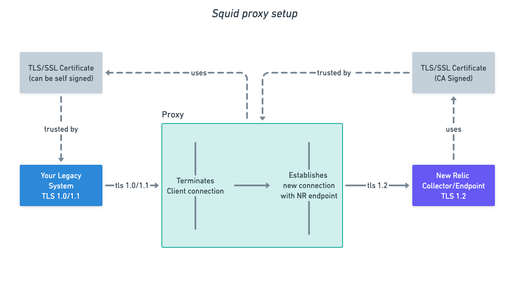

# TLS Proxy 
>Intercepting legacy TLS (1.0/1.1) traffic and converting to TLS 1.2

# Squid TLS Upgrade Proxy Example

This project demonstrates how you can use a  proxy such as Squid to upgrade TLS requests that use TLS versions <1.2. This should be considered a last resort for systems that cannot be upgraded to use TLS 1.2+ which was released in 2008.

## Upgrading TLS with ssl_bump

Usually a proxy will not intercept TLS encrypted traffic, rather it will provide a tunnel through which the client and server commmunicaiton travel.

It is possible, however, to configure the proxy to intercept the traffic: the request from the client is terminated within the proxy and a new connection is established to the server. This example uses the Squid **ssl_bump** feature to do just this. It allows the proxy to receive TLS1.0/1.1 traffic on one side of the proxy but use TLS1.2+ on the other side.

It should be noted that intercepting TLS traffic has security and legal concerns and should only be used where necessary.  Furthermore, note that the proxy must present a TLS certificate to the client (legacy system) that is trusted by that system.  As documented in the diagram, the certificate can be [self-signed](https://en.wikipedia.org/wiki/Self-signed_certificate), but it must be trusted by the client for it to establish a TLS session between the client and the proxy.

## Anatomy of example code

This example code uses Docker to stand up two containers:

- The first container is a simple example Java application that has its JVM configuration set to force TLS1.0 traffic. This means that connections it makes to https destinations use TLS1.0.

- The second container runs a version of the Squid proxy configured with ssl_bump to intercept the traffic from the application and upgrade the TLS accordingly.

## Testing the code

To run the example you must add your New Relic INGEST license key to the [docker-compose.yaml](docker-compose.yaml) file.

### Confirming TLS1.0 Traffic

To verify that TLSv1.0 traffic is being received by New Relic you need to first disable the proxy and run the application. To do this:

1. Comment out the `NEW_RELIC_PROXY_HOST`, `NEW_RELIC_PROXY_PORT`,`NEW_RELIC_CA_BUNDLE_PATH` in [docker-compose.yaml](docker-compose.yaml)
2. Run `docker compose up` to launch the application and proxy.
3. Once the application is running you can access it at [http://localhost:8080](http://localhost:8080)

Because you have commented out the proxy settings the application agent will connect directly to New Relic. You can confirm that traffic is received in New Relic and you should see a warning about TLS in `NrIntegrationError`:

- Transactions NRQL Query: `select * from Transaction where appName like 'SQUID-TLS1.0-BUMP%'`
- Warnings NRQL Query: `select * from NrIntegrationError since 10 minutes ago where category='Deprecated TLS Version'`

> Note: this test will fail once New Relic completes the [deprecation of < TLSv1.2 traffic](https://discuss.newrelic.com/t/tls-1-0-1-1-to-be-disabled-for-all-inbound-connections-on-feb-1st-2023/188451) 

### Confirming >=TLS1.2 Traffic

To verify that TLS is being upgraded by the proxy and correctly received by New Relic enable the proxy for the application. To do this:

1. Change the value for `NEW_RELIC_APP_NAME` to "SQUID-TLS1.0-BUMP-UPGRADED" in [docker-compose.yaml](docker-compose.yaml)
1. Uncomment `NEW_RELIC_PROXY_HOST`, `NEW_RELIC_PROXY_PORT`,`NEW_RELIC_CA_BUNDLE_PATH` 
2. Run `docker compose up` to launch the application and proxy.
3. Once the application is running you can access it at [http://localhost:8080](http://localhost:8080)

You have now specified that the application agent should use the proxy for communication with New Relic. You can confirm that you see traffic but that there is no warning showing in `NrIntegrationError`

- Transactions NRQL Query: `select * from Transaction where appName like 'SQUID-TLS1.0-BUMP%'`
- Warnings NRQL Query: `select * from NrIntegrationError since 10 minutes ago where category='Deprecated TLS Version'`

## Squid Configuration

The Squid proxy is configured with [squid.conf](proxy/squid.conf) wit the [ssl_bump](https://wiki.squid-cache.org/Features/SslBump) feature enabled. This is a simple configuration that you may need to extend or configure to your own purposes.

The Squid proxy must be trusted by the agent in order to establish a TLS connection. This is handled by deploying a TLS certificate chain to the proxy in the [/certs](proxy/certs) folder and bundling the necessary CA bundle in the agent configuration (see `NEW_RELIC_CA_BUNDLE_PATH` in [docker-compose.yaml](docker-compose.yaml)). 

In order for Squid running on Debian 11 to accept < TLSv1.2 connections the OpenSSL configuration has to be configured to allow it. This is configured by setting the `MinProtocol` to "TLSv1.0" in [openssl.cnf](proxy/openssl.cnf). This is the only change to the default OpenSSL configuration file.

## Windows

If your legacy system is a Windows based server, please see [this guide](https://docs.google.com/document/d/1-Ym6PW_kkbelL6d_0Et6JjPzXH5CAmor73CtPL_1ydk) if you're experiencing issues with the certificate setup

## Contributing

We encourage your contributions to improve [TLS Proxy](../../)! Keep in mind when you submit your pull request, you'll need to sign the CLA via the click-through using CLA-Assistant. You only have to sign the CLA one time per project. If you have any questions, or to execute our corporate CLA, required if your contribution is on behalf of a company, please drop us an email at opensource@newrelic.com.

**A note about vulnerabilities**

As noted in our [security policy](../../security/policy), New Relic is committed to the privacy and security of our customers and their data. We believe that providing coordinated disclosure by security researchers and engaging with the security community are important means to achieve our security goals.

If you believe you have found a security vulnerability in this project or any of New Relic's products or websites, we welcome and greatly appreciate you reporting it to New Relic through [HackerOne](https://hackerone.com/newrelic).

## License

TLS Proxy is licensed under the [Apache 2.0](http://apache.org/licenses/LICENSE-2.0.txt) License.

>TLS Proxy also uses source code from third-party libraries. You can find full details on which libraries are used and the terms under which they are licensed in the third-party notices document.]
